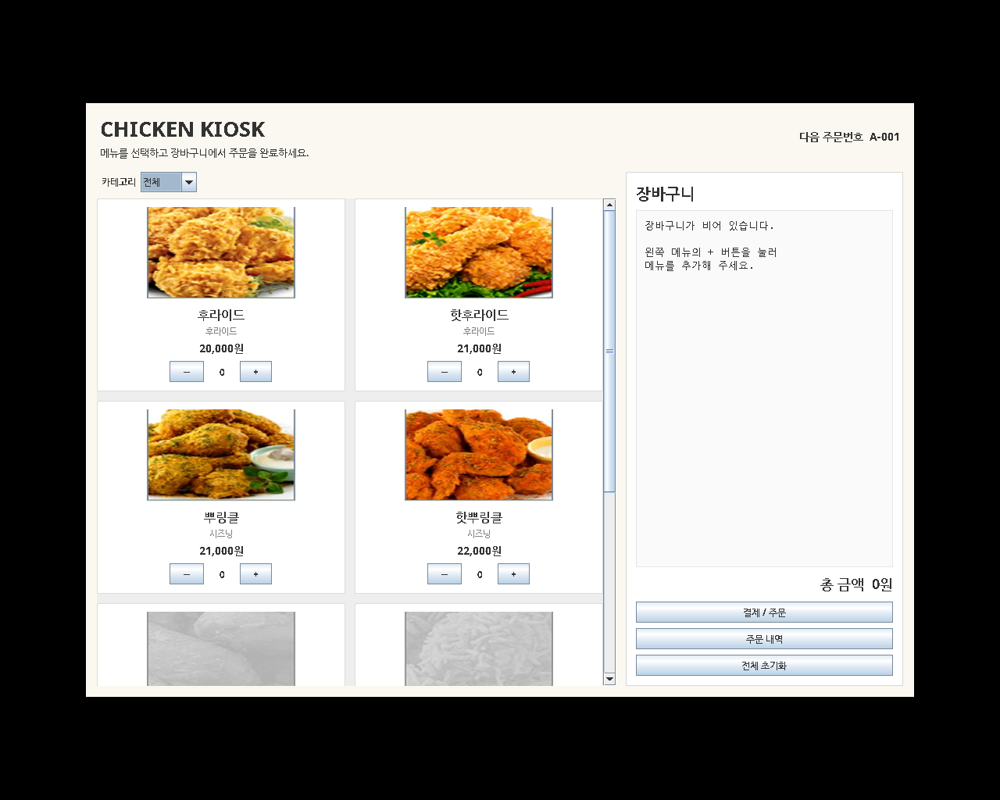

# Chicken Kiosk Java

Java Swing으로 구현한 **치킨 주문 키오스크 데스크톱 애플리케이션**입니다.

학교 Java 프로그래밍 프로젝트를 기반으로 메뉴 선택, 장바구니, 결제, 주문번호 생성, 주문내역 확인까지 하나의 주문 흐름으로 구현했습니다.



---

## 주요 기능

- 치킨 메뉴 8종 이미지 표시
- 카테고리별 메뉴 필터링
- 메뉴별 수량 증가 / 감소
- 장바구니 및 총 주문금액 실시간 계산
- 카드 / 현금 결제 방식 선택
- 현금 결제 시 받은 금액 및 거스름돈 계산
- 주문번호 자동 생성 (`A-001`, `A-002` ...)
- 완료된 주문내역 조회
- 주문 완료 후 장바구니 초기화
- 메뉴 이미지 JAR 리소스 포함

---

## 사용 기술

- Java
- Java Swing
- AWT Event Handling
- Maven
- Git / GitHub

---

## 프로젝트 구조

```text
Chicken_Kiosk_Java/
├─ README.md
├─ .gitignore
├─ pom.xml
├─ screenshots/
│  └─ demo.png
└─ src/
   └─ main/
      ├─ java/
      │  └─ com/porlaumenart/chickenkiosk/
      │     ├─ ChickenKiosk.java
      │     ├─ MenuItem.java
      │     ├─ OrderItem.java
      │     └─ Order.java
      └─ resources/
         └─ images/
            ├─ fried.jpg
            ├─ hot-fried.jpg
            ├─ bburinkle.jpg
            ├─ hot-bburinkle.jpg
            ├─ goldking.jpg
            ├─ poteking.jpg
            ├─ yangnyeom.jpg
            └─ matchoking.jpg
```

---

## 실행 환경

```text
JDK 11 이상
Maven 3.x
```

---

## 실행 방법

### 1. 저장소 Clone

```bash
git clone https://github.com/PorlauMenart/Chicken_Kiosk_Java.git
cd Chicken_Kiosk_Java
```

### 2. 프로젝트 빌드

```bash
mvn clean package
```

### 3. 실행

```bash
java -jar target/chicken-kiosk-1.0.0.jar
```

또는 Eclipse / IntelliJ에서 `ChickenKiosk.java`의 `main()` 메서드를 실행할 수 있습니다.

---

## 주문 흐름

```text
메뉴 선택
   ↓
장바구니 / 금액 계산
   ↓
결제 방식 선택
   ↓
카드 결제 또는 현금 / 거스름돈 계산
   ↓
주문번호 생성
   ↓
주문 완료 및 주문내역 저장
```

---

## 구현 구조

- `MenuItem` : 메뉴명, 가격, 카테고리, 이미지 정보 관리
- `OrderItem` : 주문 메뉴와 수량 및 소계 관리
- `Order` : 주문번호, 주문시각, 결제수단, 주문내역 관리
- `ChickenKiosk` : Swing UI와 장바구니·결제 이벤트 처리

---

## 프로젝트를 통해 학습한 내용

- Java Swing 기반 GUI 및 이벤트 처리
- 객체를 활용한 메뉴·주문 데이터 모델링
- 장바구니 상태 관리 및 실시간 금액 계산
- 주문번호와 주문내역 관리
- 이미지 리소스를 포함한 실행 가능한 JAR 구성

---

## 참고사항

본 프로젝트는 Java GUI 프로그래밍과 객체지향적인 상태 관리 방식을 학습하기 위해 제작한 학교 프로젝트입니다.

주문내역은 프로그램 실행 중 메모리에 저장되며, 프로그램 종료 후에도 유지하려면 파일 또는 데이터베이스 저장 기능을 추가할 수 있습니다.

---

## Author

**PorlauMenart**
